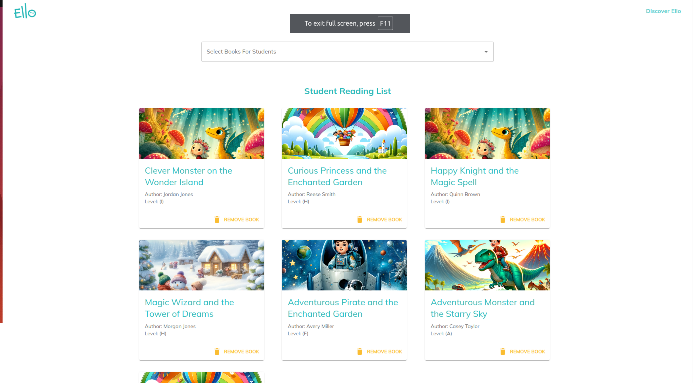

## Web Book View

Name: Brenda Kiptim
Email: brendajkiptim@gmail.com

### Installation Instructions:

1. **Backend:**

After cloning, `cd` into the `backend` folder, install npm packages and run the server on port 4000:

```
cd backend
npm install
npm run start
```

confirm it is running on port 4000 http://localhost:4000/:

2. **Frontend:**

After cloning the project, `cd` into the `frontend` folder, install npm packages and run the server on port 3000:

```
cd frontend
npm install
npm run start
```

Once the client is running this is what you should see when you visit http://localhost:3000/:

**Landing Page Screenshot**:


#### Potential Areas of improvement:

- **Error Handling**: I could add Error boundaries and generally deal with the api call error handling better.
- **Prop Drilling**: There is some prop dealing happening due to the lack of state management tool since that is not in the scope but this can definitely be improved.
- **UI/UX Design**: Due to time constraints, the design could be better with more though put in place on ways to make the functionality a bit more intuitive.
